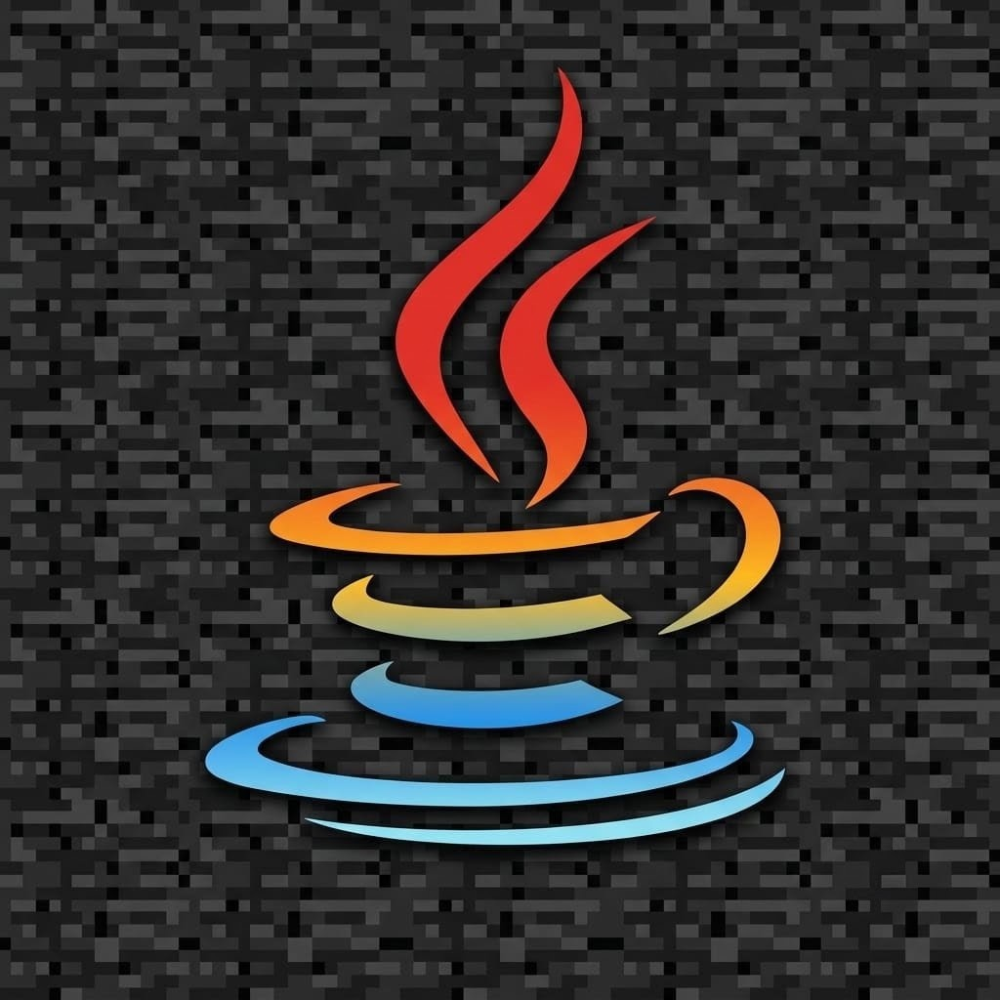

  

<h1 align="center">Jarock</h1>

  
  
  
  

  
  
  
  

  
  
  
  
  

Beginner-friendly template and documentation for a professional Minecraft Java 26.2 server.

## Recommended architecture

### First choice: Fabric

- Fabric Server for Minecraft Java 26.2
- Fabric API
- Geyser-Fabric for Java/Bedrock cross-play
- Floodgate-Fabric for Bedrock authentication
- Native Fabric performance and technical mods
- Java 25 runtime

### Loader selection on first start

If `LOADER_TYPE=none` in the local settings, the first `start-server.bat` run asks which loader to use. The same prompt can open `parameter-manager.bat` so RAM, GUI/console mode, GC profile, online-mode, Java environment automation and the optional startup update check can be configured before installation.

- **Fabric:** recommended; the Fabric launcher is renamed to the local runtime `server/server.jar`, while the vanilla engine is retained as `server/vanilla-server.jar`. Jarock maintains Fabric's launcher metadata so it points to the vanilla jar rather than the launcher itself.
- **NeoForge:** fallback; the official installer generates `run.bat`, libraries and `user_jvm_args.txt`, which Jarock starts without inventing a fragile wrapper jar. NeoForge therefore does not use a portable `server.jar` entry point.
- **Forge:** shown for clarity but currently unavailable because no official Minecraft 26.2 server build has been verified. It is not silently installed.

### Fallback: NeoForge

If an essential mod or modpack is not available for Fabric, use **NeoForge** for Minecraft 26.2:

- NeoForge Server
- Geyser-NeoForge
- Floodgate-NeoForge
- Native NeoForge mods only
- Java 25 runtime, unless the current official tooling states otherwise

**Forge and NeoForge are separate loaders.** For modern Minecraft 26.2, NeoForge is the practical choice; Forge mods are not automatically compatible with NeoForge.

Neither Fabric nor NeoForge automatically runs Bukkit/Spigot/Paper plugins. If the main requirement is a large collection of mature Bukkit plugins, use a plugin-first Paper/Spigot architecture instead. Hybrid projects should be considered only when an exact 26.2 build exists and has been tested separately.

## Quick start

1. Install a supported 64-bit Java 25 runtime for Minecraft 26.2. A direct installer link is available in the guide. **If you use the Eclipse Temurin installer:** during setup, enable the "Set JAVA_HOME variable" option (click the red X and select "Will be installed on local hard drive"). Without `JAVA_HOME`, Jarock may not find Java.
2. Clone or download this repository.
3. Double-click `start-server.bat` once; if no loader is configured, choose Fabric, Forge or NeoForge. You can optionally open `parameter-manager.bat` during this flow. If you choose `Exit without saving`, setup is cancelled cleanly and the server is not started.
4. The bootstrap installs the selected loader and downloads only the matching pinned mods. The Fabric and NeoForge stacks include the verified server-side No Chat Reports build for Minecraft 26.2. Fabric also includes Essential Commands 0.41.0 with its required `ec-core` 1.3.0 component, InvView 1.4.21 for server-side inventory and ender-chest administration, OfflineCommands 1.0.3 for running commands on offline players (the reviewed artifact filename includes `26.1-rc-3` but its Modrinth metadata explicitly includes 26.2), plus Links In Chat for clickable chat URLs and `/link`/`/linkwhisper`, and Welcome Message with its required Collective library for configurable join messages; clients do not need to install these server mods. Essential Commands, InvView and OfflineCommands are Fabric-only because no compatible NeoForge 26.2 builds are available; Welcome Message and Collective support Fabric and NeoForge 26.2.
- **Async:** experimental server-side entity-processing optimization for Fabric and NeoForge 26.2; it may cause crashes or incompatibilities, so test with a backup and remove/disable it if the server becomes unstable.
5. On the first Jarock-managed startup, the configured `server/config/welcomemessage.json5.jarock` replaces Welcome Message's generic `welcomemessage.json5` with the Jarock welcome text and links. Later starts preserve the operator's edits. The template is preserved by `clean-server-runtime.bat` and updated by verified Lite-package updates.
6. Read the generated `server/eula.txt` and, if you accept the Minecraft EULA, change `eula=false` to `eula=true`.
7. On bootstrap, Jarock verifies and installs Better Multiplayer Sleep as a datapack in the configured world's `datapacks/` folder. It never replaces the world or other datapacks; use `/reload` after a manual datapack change.
7. Double-click `start-server.bat` again.
8. When the server finishes loading, Jarock prints the LAN connection addresses: Java uses the configured `server-port` over TCP, and Bedrock uses the configured Geyser UDP port. This address message remains visible even when `Show ready banner` is disabled; only the ASCII art is hidden. The multiplayer list uses the tracked `server/server-icon.png`; the server runtime also includes `server/icon.png`; new worlds receive the tracked root `icon.png` as their default world icon without replacing a custom world icon. All three tracked icons are included in the automatic Full and Lite release ZIPs. `clean-server-runtime.bat` preserves `server/icon.png` and `server/server-icon.png`; the root `icon.png` and `logo.png` are outside its cleanup scope.
9. Type `stop` in the server console to shut it down safely.
10. **Do not close the window immediately after typing `stop`.** Wait until Minecraft finishes saving and Jarock prints `SAFE TO CLOSE`. If that message does not appear, treat the shutdown as abnormal and inspect the logs before restarting.

Always use `start-server.bat` to launch this repository. It repairs Fabric's local launcher metadata before starting. Do not double-click `server/server.jar`: that bypasses the repair and Windows may associate it with Java 8 or Java 21, producing `UnsupportedClassVersionError` or a missing-game error.

Startup update modes: `AUTO_UPDATE_MODE=install` checks for a compatible release and installs the verified Lite package automatically; `AUTO_UPDATE_MODE=check` checks for updates only and never installs; `AUTO_UPDATE_MODE=never` does not check for updates and does not install updates. The default is `AUTO_UPDATE_MODE=install`; choose `check` or `never` in `parameter-manager.bat` to override it.

The bootstrap calculates its root from the location of the repository, so it does not depend on a fixed drive or folder. It supports spaces, Unicode names and ordinary deeply nested paths. If the Windows path is long enough to risk the legacy 260-character limit, it checks `LongPathsEnabled` and requests administrator permission to enable it; the script prints whether the change succeeded. It cannot bypass folders for which Windows denies access, unavailable drives, network shares that do not support long paths, or legacy applications that are not long-path-aware. The bootstrap downloads generated runtime files into `server/`, which is ignored by Git. The selected loader manifest includes No Chat Reports for Minecraft 26.2; it disables chat-reporting signatures server-side, but clients may still show vanilla unsigned-chat warnings unless they also use a compatible client-side setup. Jarock does not alter `enforce-secure-profile` automatically. It does **not** open router ports, change firewall rules, configure port forwarding, or expose the server publicly. Configure those items manually only after completing [TODO.md](TODO.md).

Fabric is the default stack and NeoForge is the fallback. Each loader receives only its own pinned mods; Forge is currently unavailable for the official 26.2 build. Fabric renames its loader launcher to the local `server/server.jar`, while NeoForge starts through its official `run.bat`. Neither loader installs or runs arbitrary Bukkit/Spigot/Paper plugins. Add a Fabric-native mod only after verifying Minecraft 26.2 compatibility and its server-side support. The bootstrap does not blindly use the first Java on `PATH`: it searches for a 64-bit Java 25+ runtime, reports the selected executable, saves it in the ignored local file `server/java-path.txt`, and reuses that exact path. If Java 25 is installed in a custom or unregistered location, put its JDK folder or `bin\java.exe` path in the local `java-home.txt` file at the repository root, or set `JAROCK_JAVA_HOME`. If only Java 8 or Java 21 is installed, it lists the detected candidates and points to the Windows x64 Java 25 JDK installer. Therefore an older Java 8 installation can remain on the computer without blocking Jarock. If a failure occurs, the launcher prints an actionable suggested fix; inspect `server/logs/latest.log` and `server/crash-reports/` when the Java process exits with an error.

## Guides

- [Complete English Fabric installation guide](docs/en/server-guide.md)
- [English first-run guide](docs/en/first-run.md)
- [English NeoForge fallback guide](docs/en/neoforge-fallback.md)
- [All installation and fallback translations (including clearly labeled English fallback summaries)](docs/README.md)
- [Configure RAM, GUI, online-mode, startup update checks, manually check for updates (`U`), world import/export and safe launch options (including Exit without saving)](parameter-manager.bat)
- [How Jarock works — English](docs/en/how-does-jarock-work.md)
- [How Jarock works — all translations](docs/README.md)
- [Documentation and translation roadmap](docs/README.md)
- [Project maintenance and contribution guidelines](CONTRIBUTING.md)

The guides explain installation from zero, Java and Bedrock networking, Geyser/Floodgate authentication, the LAN addresses printed after the ready banner, the verified Better Multiplayer Sleep datapack, optimization and redstone mods, world import and export, backups, security, troubleshooting and the limitations of client-side mods. The parameter manager edits a temporary copy and commits settings only through Save and exit or Save and start; Exit without saving leaves the existing settings unchanged. Press `U. Check for Jarock updates` to query GitHub without starting the server; if a verified compatible Lite package is available, the updater asks `Download and install it now? (y/N)` before changing anything. It can also set Minecraft `online-mode`; keep it `true` by default, and use `false` only with a trusted authentication proxy because offline mode is unsafe on a public server. World import (`I`) asks `Remember this world for future starts? (Y/n)` after a source is selected; the default is Yes. A remembered source remains saved and is used only when the configured world is later deleted, while normal restarts keep the active world unchanged. Answer `n` for a one-shot import. World export (`E`) mirrors the world to a destination folder outside `server/` after every clean shutdown. See [TODO.md](TODO.md) for the work that remains before public access.

## License

This project is released under the [MIT License](LICENSE).
<!-- jarock-console-close-protection -->

> **Windows console close protection:** While Jarock is running, the classic Windows console shows a warning MsgBox if you click `X`, telling you to type `stop` (or close the Minecraft GUI normally) and wait for `SAFE TO CLOSE`. Jarock relaunches its launchers in the classic Windows Console Host when they are started from Windows Terminal, so the close-event protection works there; other pseudo-terminals without a marker (for example Alacritty) are not auto-detected, and Windows can still force-terminate a console process after its control-handler timeout. Always use `stop` and wait for `SAFE TO CLOSE`; never force-close while the world is saving.
